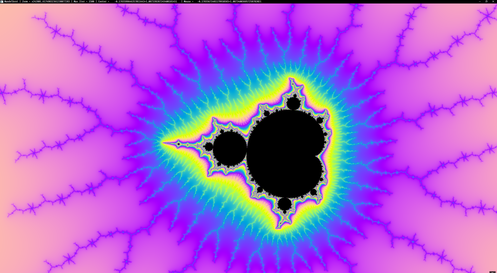

# Mandelbrot Set Explorer ([`wgpu`] + [`winit`])

A GPU-accelerated Mandelbrot set explorer I had always dreamed to make.
Implemented using [`wgpu`] and [`winit`].

## Screenshots

|  |
| :---------------------------------: |
|             `-0.875+0i`             |

<details>
<summary>

### More screenshots

</summary>

|              |
| :-----------------------------------------------: |
| `-1.76890083019633803652+0.00196313078063698127i` |

|                    |
| :-----------------------------------------------: |
| `-1.96674830636502062653+0.00000000208939884234i` |

|           |
| :----------------------------------------------: |
| `-0.1765599646357011443+1.08733928724540818145i` |

|  |
| :-------------------------------------------------: |
|  `-1.7692784002942480992+0.00331152861491198873i`   |

|  |
| :-----------------------------------------------------------: |
|       `-1.7692784002942480992+0.00331152861491198873i`        |

</details>

## Features

-   Real-time rendering of Mandelbrot and Julia sets
-   Zooming and panning
-   Adjustable iteration depth
-   Fullscreen mode
-   Pretty colors

## Controls

| Action                    | Input                                               |
| ------------------------- | --------------------------------------------------- |
| Move                      | <kbd>W</kbd> <kbd>A</kbd> <kbd>S</kbd> <kbd>D</kbd> |
| Zoom                      | Mouse scroll                                        |
| Zoom at cursor            | <kbd>Ctrl</kbd> + mouse scroll                      |
| Toggle Mandelbrot/Julia   | <kbd>Spacebar</kbd>                                 |
| Toggle color rotation     | <kbd>Q</kbd>                                        |
| Reset view                | <kbd>R</kbd>                                        |
| Decrease iterations (100) | <kbd>,</kbd> (comma)                                |
| Increase iterations (100) | <kbd>.</kbd> (period)                               |
| Fullscreen toggle         | <kbd>F11</kbd>                                      |
| Exit                      | <kbd>Esc</kbd>                                      |

## Technical Details

### Implementation

-   Uses [`wgpu`] so should work on all platforms with Vulkan/Metal/DX12
-   `f64` usage prevented me from porting it to web
    -   May not work on your GPU due to that
-   View precision limited to ~4.3 × 10<sup>13</sup> (floating point limits)

## Building and Running

### Prerequisites

-   Rust toolchain (install via [`rustup`])
-   System with Vulkan/Metal/DX12 support
-   GPU with double-precision support (most dedicated GPUs)

### Installation

Build from source:

```bash
git clone https://github.com/zohnannor/mandelbrot-explorer-wgpu
cd mandelbrot-explorer-wgpu
cargo run --release
```

Using `cargo`:

```bash
cargo install --git https://github.com/zohnannor/mandelbrot-explorer-wgpu
mandelbrot-explorer-wgpu
```

## Performance Notes

-   Higher iteration counts provide more detail but reduce performance in
    certain areas of complex plane

## TODO

-   [ ] Automatic max iterations
-   [ ] Palettes?
-   [ ] Ability to enter coordinates
    -   [ ] And copy current

## License

Licensed under either of

-   Apache License, Version 2.0 ([LICENSE-APACHE](LICENSE-APACHE-2.0))
-   MIT license ([LICENSE-MIT](LICENSE-MIT))

at your option.

[`rustup`]: https://rustup.rs
[`wgpu`]: https://docs.rs/wgpu
[`winit`]: https://docs.rs/winit
